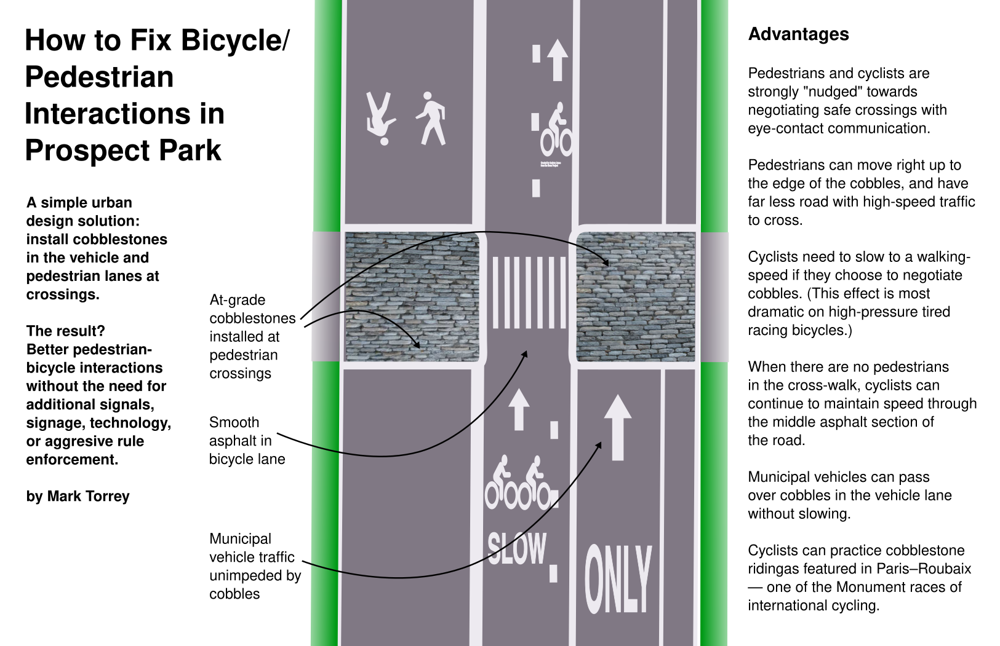

# A solution to the bicycle problem in Prospect and Central parks, NYC
* Bicycles move very quickly on the main drives in Prospect and Central parks.
* There is a perennial problem with pedestrians wanting to cross the drives, and cyclists not wanting to stop.
* A simple solution: Use cobblestones to direct bicycle paths and control bicycle speeds.

{:width="100%"}

